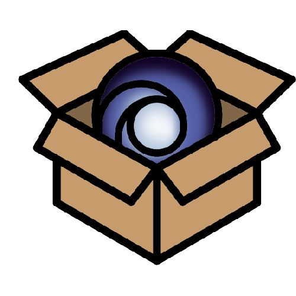

#  Ubistock

A simple website to manage a company physical resources like a file system.

## Usage

Require Docker Compose.

| Command         | Description                                          |
|-----------------|------------------------------------------------------|
| `make build`    | Build Docker images                                  |
| `make start`    | Start Docker Compose                                 |
| `make stop`     | Stop Docker Compose                                  |
| `make clean`    | Clean database data (require root) and docker images |
| `make db-clean` | Clean database data (require root)                   |

Project is then accessible though : http://localhost:8080/.

## Docker containers

| Container | Description                                                       | Public port |
|-----------|-------------------------------------------------------------------|-------------|
| `app`     | App entrypoint. One index.html file working with Riot.js and AJAX | 8080        |
| `api`     | PHP REST API                                                      | 8081        |
| `mysqldb` | MySQL DB storage                                                  |             |
| `proxy`   | NGINX reverse proxy for CORS policies                             | 8082        |

## Screenshots

### Home page

### Register a new company

### Login

### Storage
#### File system (⚠️ = minimum quantities not respected)

#### Create and rename storages

#### Storages and resources properties

### Company information

### Members
#### Add

#### List

#### Edit

### Groups
#### Add

#### Storage explorer

#### List

#### Edit

### Logs
#### List

#### More information

